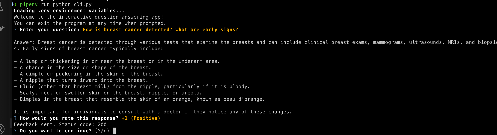
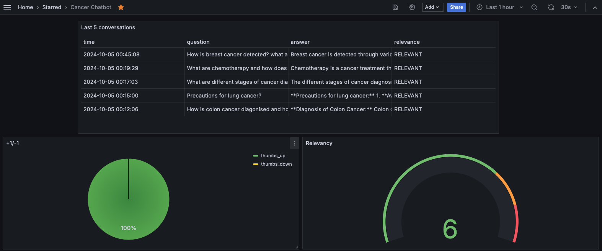

# Cancer_Q-A_chatbot
LLM based Chatbot for Cancer related questions.

This project was implemented for LLM Zoomcamp - a free course about LLMs and RAG.


<p align="center">
  
</p>

## Project overview

The Cancer Chatbot Assistant is a RAG application designed to assist users with their cancer related quetions.

The main use cases include:

1. Learning about various cancer types.
2. Precautions and diagnosis for the respective cancer types.
3. Knowledge base on cancer related questions, terminalogy etc.


## Dataset 

The dataset used in this project contains information about Cancer related data, including:

1. Question
2. Answers (large chunk of text)


You can find the data in [`data/CancerQA_data.csv`] (data/CancerQA_data.csv) .

## Technologies

* Python 3.12
* Docker and Docker Compose for containerization
* [Minsearch] (https://github.com/alexeygrigorev/minsearch) for full-text search
* Flask as the API interface (see Background for more information on Flask)
* Grafana for monitoring and PostgreSQL as the backend for it
* OpenAI as an LLM


## Preparation

Since we use OpenAI, you need to provide the API key:

1. Install `direnv`. If you use Ubuntu, run `sudo apt install direnv` and then `direnv hook bash >> ~/.bashrc`.
2. Copy `.envrc_template` into `.envrc` and insert your key there.
3. For OpenAI, it's recommended to create a new project and use a separate key.
4. Run `direnv allow` to load the key into your environment.

For dependency management, we use pipenv, so you need to install it:

```bash
pip install pipenv
```

Once installed, you can install the app dependencies:

```bash
pipenv install --dev
```

## Running the application

### Database configuration

Before the application starts for the first time, the database needs to be initialized.

First, run `postgres`:

```bash
docker-compose up postgres
```

Then run the db_prep.py script:

```bash
pipenv shell

cd fitness_assistant

export POSTGRES_HOST=localhost
python db_prep.py
```

To check the content of the database, use pgcli (already installed with pipenv):

```bash
pipenv run pgcli -h localhost -U your_username -d course_assistant -W
```

You can view the schema using the \d command:

```bash
\d conversations;
```

And select from this table:

```bash
select * from conversations;
```

### Running with Docker-Compose

The easiest way to run the application is with docker-compose:

```bash
docker-compose up
```

### Running locally

If you want to run the application locally, start only postres and grafana:

```bash
docker-compose up postgres grafana
```

If you previously started all applications with docker-compose up, you need to stop the app:

```bash
docker-compose stop app
```
Now run the app on your host machine:

```bash
pipenv shell

cd Cancer_chatbot

export POSTGRES_HOST=localhost
python app.py
```

### Running with Docker (without compose)

Sometimes you might want to run the application in Docker without Docker Compose, e.g., for debugging purposes.

First, prepare the environment by running Docker Compose as in the previous section.

Next, build the image:

```bash
docker build -t cancer_chatbot .
```

And run it:

```bash
docker run -it --rm \
    --env-file=".env" \
    -e OPENAI_API_KEY=${OPENAI_API_KEY} \
    -e DATA_PATH="data/CancerQA_data.csv" \
    -p 5001:5001 \
    cancer_chatbot
```

## Using the application

When the application is running, we can start using it.

### CLI

We built an interactive CLI application using [questionary] (https://questionary.readthedocs.io/en/stable/) .

To start it, run:
```bash
pipenv run python cli.py
```

You can also make it randomly select a question from our ground truth dataset:

```bash
pipenv run python cli.py --random
```

### Using `requests`

When the application is running, you can use requests to send questions—use test.py for testing it:

```bash
pipenv run python test.py
```

It will pick a random question from the ground truth dataset and send it to the app.

### CURL

You can also use `curl` for interacting with the API:

```bash
URL=http://localhost:5001
QUESTION="What are different types of breast cancers?"
DATA='{
    "question": "'${QUESTION}'"
}'

curl -X POST \
    -H "Content-Type: application/json" \
    -d "${DATA}" \
    ${URL}/question
```

You will see something like the following in the response:

```json
{
  "answer": "Different types of breast cancers include:\n\n1. **Ductal Carcinoma**: This is the most common type of breast cancer, which begins in the cells of the ducts.\n2. **Lobular Carcinoma**: This type of cancer originates in the lobules and is more often found in both breasts compared to other types.\n3. **Inflammatory Breast Cancer**: An uncommon type characterized by a warm, red, and swollen breast.\n4. **Ductal Carcinoma In Situ (DCIS)**: A noninvasive condition where abnormal cells are found in the lining of a breast duct.\n5. **Lobular Carcinoma In Situ (LCIS)**: Abnormal cells found in the lobules, which seldom becomes invasive cancer.\n6. **Paget Disease of the Nipple**: Involves abnormal cells in the nipple only. \n\nFor male breast cancer, common types include infiltrating ductal carcinoma, ductal carcinoma in situ, inflammatory breast cancer, and Paget disease of the nipple.",
  "conversation_id": "6681f8f8-60ee-459a-9151-aa9b6377b53f",
  "question": "What are different types of breast cancers?"
}
```

### Sending feedback:

```bash
ID="6681f8f8-60ee-459a-9151-aa9b6377b53f"
URL=http://localhost:500`
FEEDBACK_DATA='{
    "conversation_id": "'${ID}'",
    "feedback": 1
}'

curl -X POST \
    -H "Content-Type: application/json" \
    -d "${FEEDBACK_DATA}" \
    ${URL}/feedback
```
After sending it, you'll receive the acknowledgement:

```json
{
    "message": "Feedback received for conversation 4e1cef04-bfd9-4a2c-9cdd-2771d8f70e4d: 1"
}
```

## Code

The code for the application is in the fitness_assistant folder:

- [`app.py`](Cancer_chatbot/app.py) - the Flask API, the main entrypoint to the application
- [`rag.py`](Cancer_chatbot/rag.py) - the main RAG logic for building the retrieving the data and building the prompt
- [`ingest.py`](Cancer_chatbot/ingest.py) - loading the data into the knowledge base
- [`minsearch.py`](Cancer_chatbot/minsearch.py)  - an in-memory search engine
- [`db.py`](Cancer_chatbot/db.py) - the logic for logging the requests and responses to postgres
- [`db_prep.py`](Cancer_chatbot/db_prep.py) - the script for initializing the database

We also have some code in the project root directory:

[`test.py`](test.py) - select a random question for testing.
[`cli.py`](cli.py) - interactive CLI for the APP.

### Interface

We use Flask for serving the application as an API.

Refer to the "Using the Application" section for examples on how to interact with the application.

### Ingestion

The ingestion script is in [`ingest.py`](Cancer_chatbot/ingest.py).

Since we use an in-memory database, minsearch, as our knowledge base, we run the ingestion script at the startup of the application.

It's executed inside [`rag.py`](Cancer_chatbot/rag.py) when we import it.

### Experiments

For experiments, we use Jupyter notebooks. They are in the notebooks folder.

To start Jupyter, run:
```bash
cd notebooks
pipenv run jupyter notebook
```

We have the following notebooks:

- [`rag-test.ipynb`](notebooks/rag-test.ipynb): The RAG flow and evaluating the system.
- [`evaluation-data-generation.ipynb`](notebooks/evaluation-data-generation.ipynb): Generating the ground truth dataset for retrieval evaluation.

### Retrieval evaluation

The basic approach - using `minsearch` without any boosting - gave the following metrics:

- Hit rate: 91%
- MRR: 52%

The improved version (with tuned boosting):

- Hit rate: 94%
- MRR: 54%

The best boosting parameters:

```python
boost = {
        'question': 2.21,
        'answer': 7.84
}
```

### RAG flow evaluation

We used the LLM-as-a-Judge metric to evaluate the quality of our RAG flow.

For gpt-4o-mini, in a sample with 600 records, we had:

- 554 (91%) RELEVANT
- 53 (8.9%) PARTLY_RELEVANT
- 3 (0.05%) NON_RELEVANT

We also tested gpt-4o on only 118 records was recieving timeout errors:

- 107 (90.5%) RELEVANT
- 11 (9.5%) PARTLY_RELEVANT

The difference is minimal, so we opted for gpt-4o-mini.

## Monitoring

We use Grafana for monitoring the application. 

It's accessible at [localhost:3000](http://localhost:3000):

- Login: "admin"
- Password: "admin"

### Dashboards

<p align="center">
  
</p>

The monitoring dashboard contains several panels:

1. **Last 5 Conversations (Table):** Displays a table showing the five most recent conversations, including details such as the question, answer, relevance, and timestamp. This panel helps monitor recent interactions with users.
2. **+1/-1 (Pie Chart):** A pie chart that visualizes the feedback from users, showing the count of positive (thumbs up) and negative (thumbs down) feedback received. This panel helps track user satisfaction.
3. **Relevancy (Gauge):** A gauge chart representing the relevance of the responses provided during conversations. The chart categorizes relevance and indicates thresholds using different colors to highlight varying levels of response quality.
4. **OpenAI Cost (Time Series):** A time series line chart depicting the cost associated with OpenAI usage over time. This panel helps monitor and analyze the expenditure linked to the AI model's usage.
5. **Tokens (Time Series):** Another time series chart that tracks the number of tokens used in conversations over time. This helps to understand the usage patterns and the volume of data processed.
6. **Model Used (Bar Chart):** A bar chart displaying the count of conversations based on the different models used. This panel provides insights into which AI models are most frequently used.
7. **Response Time (Time Series):** A time series chart showing the response time of conversations over time. This panel is useful for identifying performance issues and ensuring the system's responsiveness.

### Setting up Grafana

All Grafana configurations are in the [`grafana`](grafana/) folder:

- [`init.py`](grafana/init.py) - for initializing the datasource and the dashboard.
- [`dashboard.json`](grafana/dashboard.json) - the actual dashboard (taken from LLM Zoomcamp without changes).

To initialize the dashboard, first ensure Grafana is
running (it starts automatically when you do `docker-compose up`).

Then run:

```bash
pipenv shell

cd grafana

# make sure the POSTGRES_HOST variable is not overwritten 
env | grep POSTGRES_HOST

python init.py
```

Then go to [localhost:3000](http://localhost:3000):

- Login: "admin"
- Password: "admin"

When prompted, keep "admin" as the new password.

## Background

Here we provide background on some tech not used in the course and links for further reading.

### Flask

We use Flask for creating the API interface for our application. It's a web application framework for Python: we can easily create an endpoint for asking questions and use web clients (like curl or requests) for communicating with it.

In our case, we can send questions to `http://localhost:5001/question`.

For more information, visit the [official Flask documentation](https://flask.palletsprojects.com/).